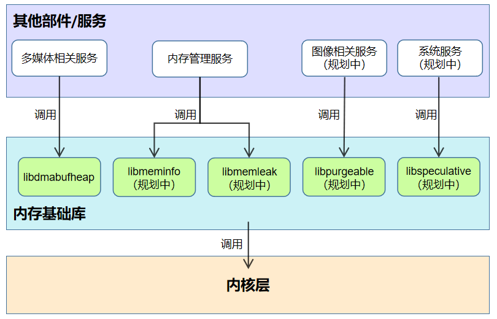

# 内存基础库部件

-   [简介](#section_introduction)
-   [部件架构图](#section_architecture)
-   [目录](#section_catalogue)
-   [内存基础库](#section_libraries)
    -   [libdmabufheap系统库](#section_libdmabufheap)
    -   [libmeminfo系统库（规划）](#section_libmeminfo)
    -   [libmemleak系统库（规划）](#section_libmemleak)
    -   [libpurgeable系统库（规划）](#section_libpurgeable)
    -   [libspeculative系统库（规划）](#section_libspeculative)
-   [使用说明](#section_usage)
-   [相关仓](#section_projects)

## 简介<a name="section_introduction"></a>

内存基础库部件位于公共基础库子系统中，为上层业务提供对应的操作内存的系统库，保证上层业务的稳定性。

## 部件架构图<a name="section_architecture"></a>



**图1** 内存基础库部件架构图

## 目录<a name="section_catalogue"></a>

```
/utils/memory
├── libdmabufheap           # DMA (Direct Memory Access) 内存分配链接库
│   ├── include             # DMA内存分配链接库头文件目录
│   ├── src                 # DMA内存分配链接库源代码目录
│   └── test                # DMA内存分配链接库自测用例目录
├── libmeminfo              # 内存占用查询库
├── libmemleak              # 内存泄漏检测库
├── libpurgeable            # 可丢弃类型内存管理库
└── libspeculative          # 投机类型内存管理库
```

## 内存基础库<a name="section_libraries"></a>

内存基础库是集成内存操作的系统库的部件，对内存操作的系统库进行统一管理。

### libdmabufheap系统库<a name="section_libdmabufheap"></a>

为业务提供分配共享内存的接口，通过在硬件设备和用户空间之间分配和共享内存，实现
设备、进程间零拷贝内存，提升执行效率。

### libmeminfo系统库（规划）<a name="section_libmeminfo"></a>

提供内存占用查询接口。主要提供给内存占用维测（hidumper）、低内存查杀服务（lmks）使用。

### libmemleak系统库（规划）<a name="section_libmemleak"></a>

配合malloc_debug做native heap内存泄漏检测。

### libpurgeable系统库（规划）<a name="section_libpurgeable"></a>

提供可丢弃类型内存的管理接口。主要提供给多媒体业务图形图像编解码库使用。

### libspeculative系统库（规划）<a name="section_libspeculative"></a>

提供投机类型内存管理接口。主要提供给系统服务使用，用于缓存预读。

## 使用说明<a name="section_usage"></a>

系统开发者可以通过配置productdefine/common/products下的产品定义json文件，增加或移除本部件，来启用或停用本部件。

` "utils:utils_memory":{} `

## 相关仓<a name="section_projects"></a>

[公共基础库子系统](https://gitee.com/openharmony/utils)